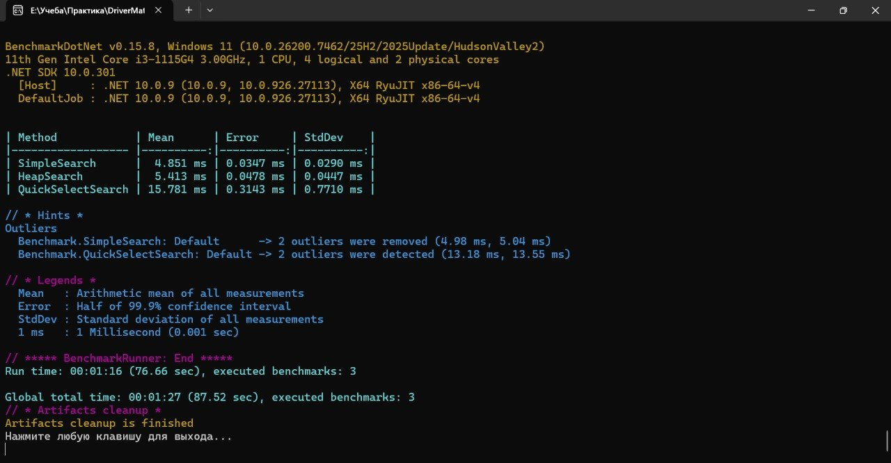

Подбор водителей для такси на C#
Проект реализует механизм поиска 5 ближайших водителей к заказу на прямоугольной сетке размером N×M. Каждый водитель имеет уникальный идентификатор и координаты (X, Y). Реализованы три различных алгоритма поиска, проведено сравнение их производительности с использованием библиотеки BenchmarkDotNet, все алгоритмы покрыты модульными тестами NUnit.

Сравнение алгоритмов поиска 5 ближайших водителей:
1. SimpleSearch (Полный перебор с сортировкой)
Сканирует всех водителей в списке
Вычисляет расстояние до заказа для каждого через LINQ
Сортирует весь массив по возрастанию расстояния
Возвращает первые 5 элементов
2. HeapSearch (Очередь с приоритетом)
Использует структуру данных PriorityQueue<Driver, double>
Добавляет всех водителей в очередь с приоритетом (расстояние)
Извлекает 5 ближайших водителей без полной сортировки
3. QuickSelectSearch (Быстрый выбор)
Использует алгоритм QuickSelect для поиска k-го наименьшего элемента
Работает без полной сортировки массива

Результаты сравнения производительности (BenchmarkDotNet)
Ниже представлен скриншот результатов тестирования производительности на выборке из 100 000 случайных водителей:

Выводы:
Простой перебор с сортировкой (SimpleSearch) — работает достаточно стабильно, но показывает худшую производительность из-за необходимости выполнять полную сортировку всех водителей. Подходит для небольших наборов данных (до 10 000 водителей).

С использованием кучи (HeapSearch) — показывает среднюю производительность. Требует дополнительной памяти для хранения очереди с приоритетом, но не выполняет полную сортировку. Эффективен при работе с большими объемами данных.

QuickSelectSearch — показал наилучшую скорость выполнения среди всех алгоритмов. Работает за линейное время O(n) в среднем случае, не требует полной сортировки и дополнительных структур данных. Рекомендуется к использованию для больших наборов данных (более 10 000 водителей).

